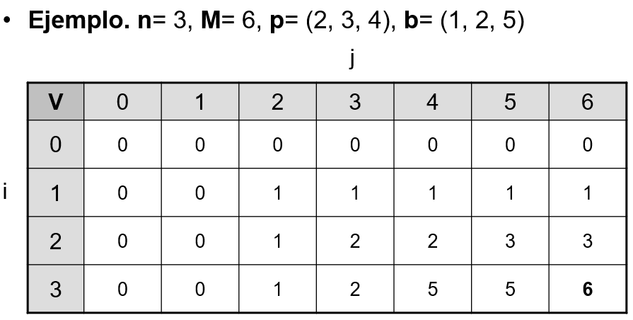
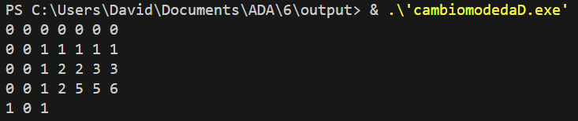

Problema de la mochila
Enunciado

En la salida se puede apreciar que utliza el 1ro y 3er  peso, obteniendo un beneficio optimo de 4+2, que es 6.

¿Cuánto será el tiempo de recomponer la solución?

Problema del cambio de monedas

