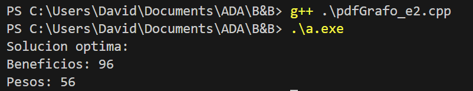

# epcc_tarea
ALGORITMOS DE EXPLORACIÓN DE GRAFOS

Ejercicio 4
Resuelva el problema del viajante de comercio utilizando la técnica B&B para 5
ciudades utilizando la siguiente matriz de distancias (que es simétrica):

Resuelva el problema de la mochila 0-1 para los siguientes valores:

Ejercicio 2

Tamaño de la mochila: M = 61
Número de objetos: n = 5
Vector de pesos: W = (1, 11, 21, 23, 33)
Vector de beneficios: B = (11, 21, 31, 33, 43)
Represente el árbol de estados que se obtendría al utilizar las técnicas de
backtracking y branch&bound. ¿Qué funciones de acotación utilizaría para
reducir el espacio de búsqueda?

